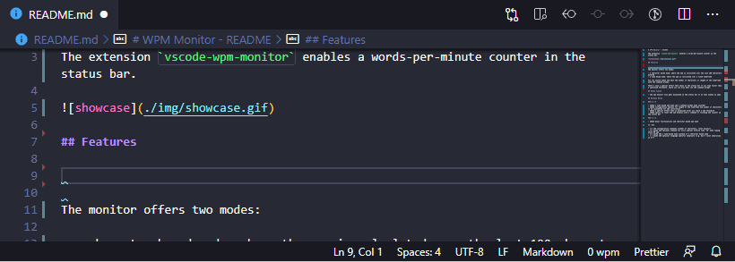

# WPM Monitor

This extension enables a words per minute counter in the status bar of the editor.

A word is counted as 5 keypresses (excluding space, delete and modifier keys).

## Features

The monitor offers two modes:

- a character based mode: where the wpm is calculated over the last 100 characters entered
- a time based mode: where the wpm is calculated over a fixed timeframe

You can quickly switch modes for the current session or reset &amp; restart the wpm monitor with the command prompt.

You can activate an automatic reset of the wpm if you stop typing for a specified duration.

There's also a special effect that shows in the status bar if you type faster than a specified threshold, which you can also edit via the command prompt.

## Configuration

- set the default mode in which the wpm monitor runs on startup
- set the number of characters that should be considered for calculating the wpm in character based mode
- set the duration of the time frame to be considered for calculating the wpm in time based mode
- set the threshold for displaying the special effect alongside the wpm monitor
- select the special effect symbol that will get displayed
- enable/disable automatic reset of wpm
- set the duration of the time frame after which the wpm will get reset if no new user input was recorded

## Known Issues

- the wpm monitor also gets displayed in the status bar if no text window is open
- the wpm monitor doesn't work in jupyter notebooks that were opened with the notebook editor of the python extension

## Release Notes

Release notes of mayor and minor releases. For a full changelog check [CHANGELOG.md](./CHANGELOG.md).

### 0.3.0

- added optional automatic wpm reset after a specified duration of no new user input
- made prompt configurations persisent by converting them into extension configurations

### 0.2.0

- added a time based wpm mode and a command prompt mode switcher
- added configuration options for length of the timeframe and number of characters to be considered for wpm calculation
- added a special effect that is displayed after you reach a wpm threshold
- added option to reset the wpm display with a command or clicking the counter in the status bar

### 0.1.0

- added basic functionality and character based wpm mode
